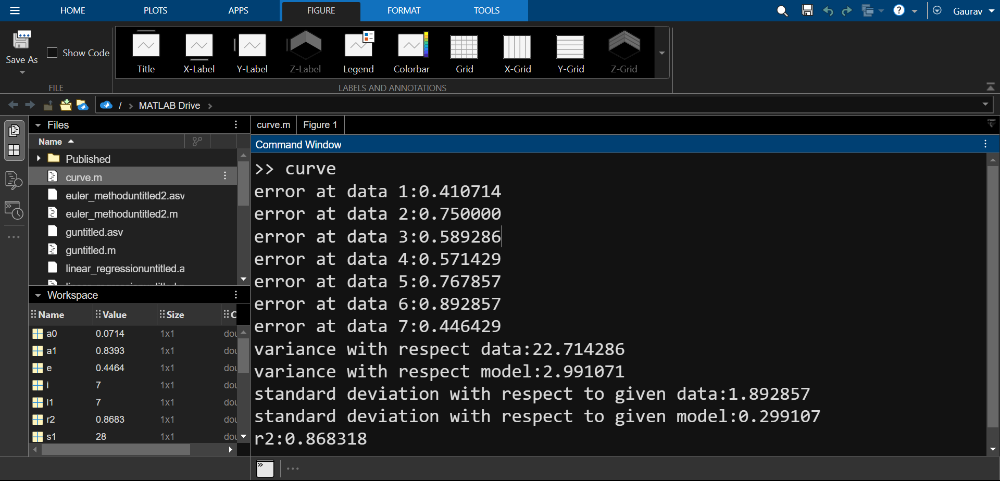

# Linear Regression Model in Matlab

This repository contains an implementation of linear regression in MATLAB. Linear regression is a machine learning algorithm used to predict a target variable based on one or more input features.

**Linear regression** is a statistical method used to model the relationship between a dependent variable (also called the target or response variable) and one or more independent variables (predictors or features). The primary objective of linear regression is to find a linear relationship that best explains the variation in the dependent variable based on the independent variables.I have used least squares method for linear regression model. Here are some key concepts related to linear regression based on the least squares approach:

1. **Linear Relationship:** Linear regression assumes that the relationship between the dependent variable (Y) and the independent variable(s) (X) is linear. This means that the change in Y is proportional to the change in X, and it can be represented by a straight line equation: Y = a + bX, where "a" is the intercept, and "b" is the slope of the line.

2. **Least Squares Method:** The least squares method is used to estimate the parameters (a and b) of the linear regression model by minimizing the sum of the squared differences between the observed values of the dependent variable and the predicted values from the model. In other words, it finds the line that minimizes the sum of the squared residuals (the vertical distances between the data points and the line).

3. **Residuals:** Residuals are the differences between the observed values of the dependent variable and the predicted values from the linear regression model. The least squares method aims to minimize the sum of the squared residuals.

4. **Intercept (a):** The intercept (a) is the value of the dependent variable when all independent variables are equal to zero. It represents the point where the regression line intersects the y-axis.

5. **Slope (b):** The slope (b) represents the rate of change in the dependent variable (Y) for a one-unit change in the independent variable (X). It indicates the direction and steepness of the linear relationship.

6. **Coefficient of Determination (R-squared):** R-squared is a statistical measure that represents the proportion of the variance in the dependent variable that is explained by the independent variable(s) in the linear regression model. It ranges from 0 to 1, with higher values indicating a better fit of the model to the data.

Requirements:
 
MATLAB

Usage
 
To use the linear regression model, simply open the linear_regression.m file in MATLAB and modify the input data and parameters as needed.

Model Image

Output

Contribution:
 
Contributions to this repository are always welcome. If you find a bug or have a suggestion for a new feature, please open an issue or submit a pull request.
