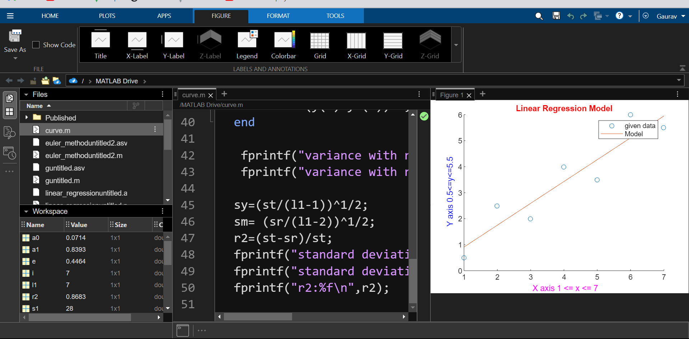

# Linear Regression Model in MATLAB

This repository contains an implementation of linear regression in MATLAB. Linear regression is a machine learning algorithm used to predict a target variable based on one or more input features.

Requirements
 
MATLAB
 

Usage
 
To use the linear regression model, simply open the linear_regression.m file in MATLAB and modify the input data and parameters as needed.

Contributing
 
Contributions to this repository are always welcome. If you find a bug or have a suggestion for a new feature, please open an issue or submit a pull request.
